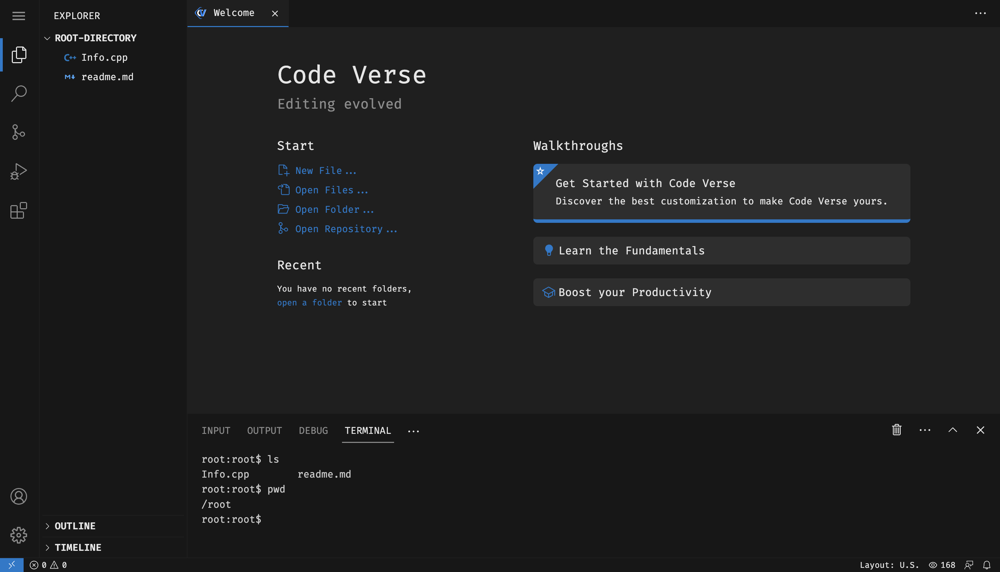

# Code Verse Frontend

[](https://drive.google.com/file/d/1fb9qxVC3P0jJJSlBV9ZefCoFSuXPaV3M/view?usp=sharing)

## Features

The code editor app offers multiple features. Here are some of the features:

- Multiple tabs for editing multiple files simultaneously
- Integrated terminal
- Search and replace functionality
- Code folding
- Import files and folders from your local system
- Download files and folders to your local system
- Persistent storage of files and folders
- Autocomplete suggestions

<br>

## Performance Optimizations

The code editor app incorporates various performance optimizations to provide a fast and responsive experience, especially when handling directory and file operations. These optimizations enhance rendering speed, reduce unnecessary computations, and leverage web workers for efficient background processing. Let's explore the specific optimizations implemented in the code editor app:

- **Virtualized Rendering** : The code editor app utilizes virtualized rendering techniques to efficiently handle large directories and files. By rendering only the visible portion of the directory/file tree, the app significantly reduces memory usage and improves overall performance. This optimization ensures smooth navigation and scrolling, even when working with extensive directory structures.

- **Debounced Updates** : When performing directory or file operations, such as searching or renaming, the app uses debounced updates. This technique limits the frequency of re-rendering and processing, reducing unnecessary computations and improving performance. It ensures that the app remains responsive, even during rapid and frequent operations.

- **Web Workers** : The code editor app employs web workers for background processing of directory and file operations. Web workers run tasks in a separate thread, offloading heavy computations from the main thread, and preventing UI blocking. This optimization enables smooth interaction with the app while performing time-consuming tasks like searching, indexing, and analyzing files.

- **Memoization** : To optimize directory and file handling operations, the app incorporates memoization. Memoization stores the results of expensive function calls and retrieves them when the same operation is requested again. By caching and reusing computed results, the app avoids redundant computations, improving response times for repetitive operations.

- **Optimized Data Structures**: The code editor app leverages optimized data structures, such as trees or hash maps, for efficient organization and retrieval of directory and file information. These data structures enhance search and retrieval operations, reducing the time required to locate and process files within the app.

By combining virtualized rendering, debounced updates, web workers, and memoization, the code editor app delivers fast and efficient directory and file handling operations. Users can seamlessly navigate directories, search for files, and perform various operations without experiencing performance degradation.

<br>

## Themes

The code editor app offers multiple themes to customize the editor's appearance. Themes provide different color schemes and styles, allowing you to personalize the coding environment. Here are some available themes:

- Dark Theme: A sleek and modern dark-themed editor with a dark background and vibrant syntax highlighting colors. It is easy on the eyes and suitable for coding in low-light conditions.

- Light Theme: A clean and bright light-themed editor with a white background and contrasting syntax highlighting colors. It offers a refreshing and professional coding experience.

- Monokai Theme: A popular theme inspired by the Monokai color scheme, known for its vibrant and visually appealing syntax highlighting. It provides a stylish and energetic coding environment.

- Solarized Theme: The Solarized theme is a balanced and well-thought-out color scheme designed for code legibility. It offers both light and dark variants, ensuring comfortable coding in different lighting conditions.

- Dracula Theme: A dark-themed editor inspired by the popular Dracula color scheme. It features a dark background with contrasting syntax highlighting colors, creating an atmospheric and visually appealing coding environment.

- Night Owl Theme: A sophisticated dark theme with carefully selected colors for optimal code readability. The Night Owl theme provides a pleasant contrast between the background and syntax elements, making code stand out while reducing eye strain.

You can easily switch between themes within the app to find the one that suits your preferences.

<br>

## Responsive Design

The code editor app is built with a responsive design approach, allowing it to adapt to different screen sizes and devices. Here are some key aspects of its responsive design:

- **Mobile-friendly**: The app's user interface is optimized for mobile devices, ensuring a seamless experience on smartphones and tablets. The code editor, tabs, terminal, and other features are all designed to work effectively on smaller screens.

- **Responsive Layout**: The app's layout adjusts dynamically based on the available screen space. This ensures that the code editor, toolbar, and other elements are appropriately positioned and sized, regardless of the device's screen size.

- **Flexible Components**: The individual components within the app are designed to be flexible and responsive. They can adjust their size and behavior based on the available screen space, providing an optimal user experience across devices.

- **Touch Support**: The app supports touch gestures, allowing users to interact with the code editor, tabs, and other elements using touch-based input. This makes it easy to navigate and edit code on touch-enabled devices.

Whether you're using a desktop computer, laptop, tablet, or smartphone, the code editor app will provide a consistent and user-friendly experience.

<br>

## Getting Started

1. Clone the repository:

   ```bash
   git clone https://github.com/vickyguptaa7/Code-Verse.git
   ```

2. Change to the `back-end` directory:

   ```bash
   cd react-code-editor
   ```

3. Install the dependencies:

   ```bash
   npm install
   ```

4. Start the development server:
   ```bash
   npm run dev
   ```
5. Open your favorite web browser and visit `http://localhost:3000` to access the code verse editor.
