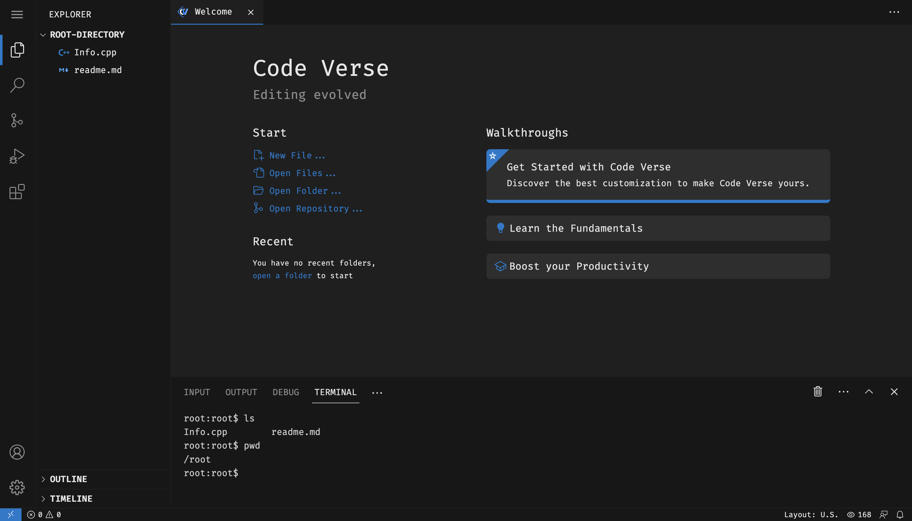

# Code Verse

    Welcome to CodeVerse, an online code editor and compiler designed to support various programming languages including Java, C++, Python, and more. With CodeVerse, you can write, edit, and execute your code seamlessly within a web-based environment.

> ## Features

- **Multi-Language Support**: CodeVerse supports multiple programming languages, providing a versatile platform for coding in Java, C++, Python, and other popular languages.

- **Online Compilation**: Compile your code online without the need for a local compiler. CodeVerse provides a convenient way to compile and run your code directly from your browser.

- **Multiple Tabs**: CodeVerse allows you to work on multiple files simultaneously. You can open multiple tabs within the application, each representing a different file. This feature enables seamless navigation and editing across multiple projects or files.

- **Integrated Terminal**: The app provides an integrated terminal right within the interface. This terminal allows you to execute commands and interact with your project's environment without needing to switch to external terminal applications.

- **Search and Replace**: CodeVerse offers a powerful search and replace functionality. You can search for specific code snippets, variables, or keywords within a file or across your entire project.

- **Code Folding**: When dealing with large code files, readability becomes crucial. CodeVerse allows you to collapse or fold sections of code, such as functions, classes, or loops, to hide their details temporarily. This feature helps you focus on specific parts of your code and improves overall code organization.

- **Autocomplete Suggestions**: CodeVerse offers intelligent autocomplete suggestions as you type. The app analyzes your code context and provides suggestions for variables, functions, and other relevant code snippets. This feature saves time, reduces typos, and helps you write code more efficiently.

 

> ## Technologies Used

    CodeVerse is built using modern web technologies and frameworks, including:

- **Frontend**: The frontend is developed using HTML, CSS, and JavaScript. It utilizes popular libraries like React.js to create a dynamic and responsive user interface.

- **Backend**: The backend is powered by Node.js and Express.js. It handles code compilation, and other server-side functionalities.
